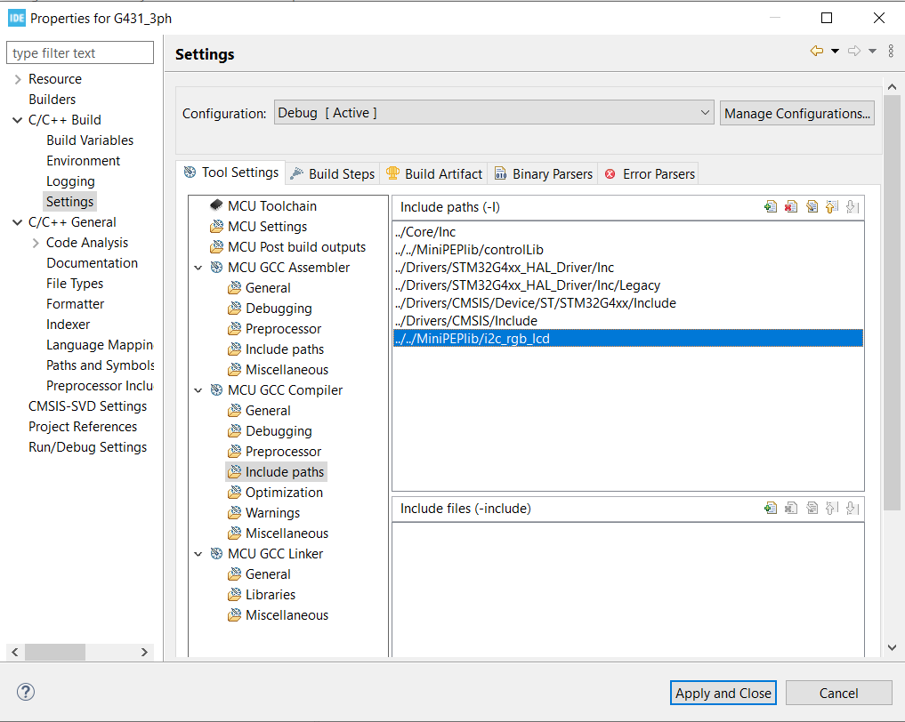
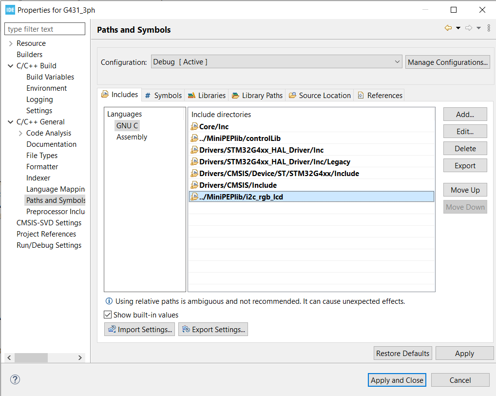

#idc_rgb_ldc

## Intro
 C library for use of rgb lcd with STM32G4 microcontroller.
 It is a simplified verion of the [ DFRobot_RGBLCD1602](https://github.com/DFRobot/DFRobot_RGBLCD1602) library originaly written for arduino.
 This STM32G4 library relies on the HAL driver layer. Meaning that, even though it has not been tried, the library should be compatible with other SMT32 microcontrollers. The only modification required sould be to replace  `#include "stm32g4xx_hal.h"` in `i2c-rgb_lcd.c"` by the HAL library corresponding to your MCU.

## How to use in your STM32CubeMX projects
1. The library folder must be linked to your project. This is done in the projects properties menu. Three places should be checked as illustrated in the pictures below:
	1. C/C++ Build -> settings -> Tool settings -> MCU GCC Compiler -> Include paths.
	2. C/C++ Genereal -> Paths and Symbols -> Includes.
	3. C/C++ Genereal -> Paths and Symbols ->Source Location.




Then, in your code:

2. Include the library:
```C
/* USER CODE BEGIN Includes */
#include "i2c-rgb_lcd.h"
/* USER CODE END Includes */
```
3. Instantiate an rgb_lcd object
```C
/* USER CODE BEGIN PV */
rgb_lcd_HandleTypeDef lcd;
/* USER CODE END PV */
```
4. Initialize it. You need to provide a pointer to the HAL Handle of the I2C peripheral that you want to use for the LCD and the addresses of the I2C LCD controller and the address of the RGB controller. (The library contains a definition for the default address of the DFRobot LCD1602 V1.0 RGB LCD module.)
```C
/* USER CODE BEGIN 2 */
  lcd_init(&lcd, &hi2c3,
		  LCD_ADDRESS_DEFAULT, 
			RGB_ADDRESS_DEFAULT);
//...
```
5. Use the various functions available to interact with your LCD
```C
//...
  lcd_home(&lcd);	// put the cursor at (0,0) position
  uint8_t str[13] = "Hello world !";
  lcd_print(&lcd, str, 13);
  lcd_setRGB(&lcd, 0, 100, 0);	// make the backlight green
/* USER CODE END 2 */
```

